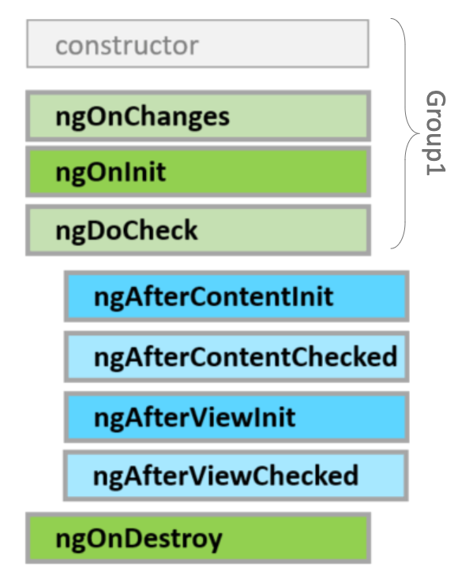

# Angular Interview Questions/Topics

## Questions
- What is Angular?
- What is Angular Material?
- What is `directive` and different types of directives?
- What are the building blocks of Angular?
- What is `Dependency Injection` (DI)?
- What is Data Binding? How many ways it can be done?
- Could you explain the various types of filters in Angular?
- What is `ViewEncapsulation` and how many ways are there to do it in Angular?
- Why prioritise TypeScript over JavaScript in Angular?
- What do you understand By `RouterOutlet` and `RouterLink`?
- Angular Component Constructor Vs OnInit
- What happens when you use the `script` tag within a template?
- What is `ViewChild` and you will want to use `{static: false}`?
- Angular Lifecycle Hooks
- What is `AOT` compilation? What are the advantages of `AOT`?
- Explain `"sourceMap": true` in angular.
- Promise vs Observable
- What are Template-driven forms and Reactive forms?
- `forRoot` vs `forChild`
- Handling Multiple http request using RxJs
- `Map` vs `mergeMap` vs `switchMap` vs `concatMap` vs `exhaustMap`
- What are class decorators?
- What is the Component `Decorator` in Angular?
- In comparison to JIT, a compilation in AOT
- How to prevent `cross-site scripting` (XSS)?
- How to improve website performance?
- Bundle Analysis
- When to Use `Put` and When `Patch`?
- What is purpose of the `angular.json`?
- Angular 17 new features
- What are some of the differences between a standard Angular component and a standalone component?
- bootstrapModule
- Angular testing framework: `Karma`, `Jasmine`
- Can we call api from constructor as well
- pre-fetch your data by using Resolvers
- Explain `Guard` in angular
- Host binding and Host listening
- Explain `Polyfill` in Angular
- Explain Router outlet in angular
- Can we use multiple router outlet?
- Can you write a component without constructor?
- Pure pipe vs Impure pipe
- Formbuilder vs Formgroup in angular


## Answers

### 1. What is Angular?
- Angular is a popular open-source framework developed and maintained by Google for building dynamic web applications.
- Angular framework is used to create `single-page-applications` (SPA).
- It utilizes `TypeScript` for building robust and scalable applications
- Provides tools and libraries for features like `data binding`, `dependency injection`, `routing`, and more. 
- Angular follows the `Model-View-Controller` (MVC) architectural pattern
- Some features:
  - Modules
  - Components
  - Templates
  - Services
  - Dependency Injection
  - Data Binding (Interpolation, Property binding, Event binding)
  - Change detection strategy (Default, OnPush)
  - Module loading strategy (Lazy loading, Eager loading)
  - Route reuse strategy
  - Routing
  - Directives
  - Pipes
  - Guards
  - Interceptors
  - Forms
  - Internationalization (i18n) and Accessibility

### 2. What is Angular Material?
- Angular Material is a UI component library developed by the Angular team at Google. 
- It provides a set of pre-built and customizable UI components for Angular applications
- Follows the Material Design principles established by Google. 
- These components include items such as buttons, cards, forms, navigation components, and more.
- Angular Material simplifies the process of creating modern and visually appealing user interfaces by offering ready-to-use components. 
- Developers can easily incorporate these components into their Angular applications.

Import Angular Material and it's dependencies
```bash
ng add @angular/material
```
Create a new component using Angular CLI
```bash
ng generate component toolbar
```
Import Angular Material modules in `app.module.ts`
```typescript
import { ToolbarComponent } from './toolbar/toolbar.component';
import { MatToolbarModule } from '@angular/material/toolbar';
import { MatButtonModule } from '@angular/material/button';

@NgModule({
  declarations: [
    AppComponent,
    ToolbarComponent
  ],
  imports: [
    BrowserModule,
    BrowserAnimationsModule,
    MatToolbarModule,
    MatButtonModule
  ],
  providers: [],
  bootstrap: [AppComponent]
})
export class AppModule { }
```
Use Material components in `toolbar.component.html`
```html
<mat-toolbar color="accent">
  <span>Angular Material Toolbar</span>
  <button mat-button color="primary">Click me!</button>
</mat-toolbar>
```

#### Create Custom Theme


### 3. What is `directive` and different types of directives?
- Directives add behavior to their host elements.
- Directives are used to extend the behavior of HTML elements or attributes in Angular applications. 
- It allows to attach behavior to elements or manipulate the DOM in various ways.

There are three types of directives in Angular:

**1. Component Directives:**
- Components are the most common type of directive in Angular.
- They are used to create custom HTML elements and encapsulate their behavior and presentation logic.
- Components have their own templates, styles, and behavior, making them self-contained building blocks of Angular applications.

**2. Attribute Directives:**
- Attribute directives changes the appearance or behavior of an element, component, or another directive.
- They are applied to elements as attributes.
- DOM friendly
- Examples of built-in attribute directives in Angular includes `ngStyle` and `ngClass` (BrowserModule).

**3. Structural Directives:**
- Structural directives changes the structure of the DOM by adding, removing, or manipulating elements.
- They usually have a star * before their name
- DOM un-friendly
- Examples of built-in structural directives in Angular includes `*ngIf`, `*ngFor`, and `*ngSwitch` (BrowserModule).

#### Host Element
A directive can interact with its host DOM element in the following ways:
- It binds to and updates its properties using `@HostBinding`
- It listens to its events using `@HostListener`

#### Create Custom Directive
Generate Directive
```shell
ng g d custom
```
Custom Directive
```typescript
import {Directive, ElementRef, Renderer2} from '@angular/core';

@Directive({
  selector: '[appCustomDirective]'
})
export class CustomDirective {
    @HostBinding('style.backgroundColor') background: string;
    @HostBinding('value') value: string;
    @HostBinding('attr.role') role: string;
    @HostBinding('style.width.px') width: number;
    @HostBinding('disabled') disabled: boolean;
    
    constructor(private elementRef: ElementRef, private renderer: Renderer2) {}

    ngOnInit() {
      // this.elementRef.nativeElement.style.fontSize = '22px'; // DOM Dependent
      this.renderer.setStyle(this.elementRef.nativeElement, 'font-size', '22px'); // DOM Independent
      this.renderer.setStyle(this.elementRef.nativeElement, 'margin', '22px');
    }

    @HostListener('mouseenter') handleMouseEnter() {
      this.renderer.setStyle(this.elementRef.nativeElement, 'color', 'red');
      this.background = 'gray';
    }
  
    @HostListener('mouseleave') handleMouseLeave() {
      this.renderer.setStyle(this.elementRef.nativeElement, 'color', 'green');
      this.background = 'white';
    }
}
```

#### Why Renderer2?
- We don’t interact with the DOM directly. Angular aims to provide a higher-level API, 
so the native platform, the DOM, will just reflect the state of the Angular application.
- It makes components easier to refactor.
- It allows unit testing most of the behavior of an application without touching the DOM.
- It allows running Angular applications in a web worker, server, or other platforms where a native DOM isn’t present (Server Side Rendering).

### 4. What are the building blocks of Angular?
- Modules
- Components
- Templates
- Services
- Dependency Injection
- Data Binding (Interpolation, Property binding, Event binding)
- Change detection strategy (Default, OnPush)
- Module loading strategy (Lazy loading, Eager loading)
- Route reuse strategy
- Routing
- Directives
- Pipes
- Guards
- Interceptors
- Forms
- Internationalization (i18n) and Accessibility

### 5. What is `Dependency Injection` (DI)?
- Dependency Injection (DI) is a design pattern 
- Enables the creation and management of objects and their dependencies within an application. 
- Provides necessary dependencies (services/objects) to a component/service rather than having the component/service create them directly.

Example:

UserService
```typescript
@Injectable({
  providedIn: 'root'
})
export class UserService {
  getUsers() {
    // Simulate fetching user data from a server
    return ['User 1', 'User 2', 'User 3'];
  }
}
```
UserListComponent
```typescript
@Component({
  selector: 'app-user-list',
  templateUrl: './user-list.component.html',
  styleUrls: ['./user-list.component.css']
})
export class UserListComponent implements OnInit {
  users: string[];
  constructor(private userService: UserService) { }
  ngOnInit() {
    // Use the UserService to fetch users
    this.users = this.userService.getUsers();
  }
}
```
AppModule
```typescript
@NgModule({
  declarations: [
    UserListComponent
  ],
  imports: [
    BrowserModule
  ],
  providers: [UserService], // Provide UserService at the module level
  bootstrap: [UserListComponent]
})
export class AppModule { }
```


### 6. What is Data Binding? How many ways it can be done?
Data binding in Angular refers to the synchronization of data between the component's model (business logic) and the view (HTML template). 
It allows you to dynamically update the view whenever the model changes, and vice versa.

There are 4 types of data binding supported in Angular:
#### Interpolation
Interpolation is the simplest form of data binding in Angular. 
It allows you to bind a component's property to the view by enclosing it within double curly braces `{{ }}`.

Component
```typescript
message = 'Hello, Angular!';
```
Template
```html
<p>{{ message }}</p>
```

#### Property Binding
Property binding allows you to set an HTML attribute or property to the value of a component's property.

Component
```typescript
imageUrl = 'https://example.com/image.jpg';
```
Template
```html

```

#### Event Binding
Event binding allows you to listen for events raised by DOM elements or child components.

Child Component
```typescript
@Component({
  selector: 'app-child',
  template: `
     <button (click)="emitEvent()">Send Data</button>
   `
})
export class ChildComponent {
  @Output() messageEvent = new EventEmitter<string>();

  emitEvent() {
    this.messageEvent.emit('Hello from Child!');
  }
}
```
Parent Component
```typescript
@Component({
  selector: 'app-parent',
  template: `
     <app-child (messageEvent)="handleMessage($event)"></app-child>
     <p>Message from Child: {{ message }}</p>
   `
})
export class ParentComponent {
  message = '';
  handleMessage(message: string) {
    this.message = message;
  }
}
```

#### Two-way Binding
Two-way binding allows you to both set and get the value of an input element. 
It's achieved using the `ngModel` directive, which combines `property binding` and `event binding` under the hood. 
It's commonly used with `form` elements like `input`, `select`, and `textarea`.

Component
```typescript
@Component({
  selector: 'app-root',
  template: `
     <input type="text" [(ngModel)]="name" placeholder="Enter your name">
     <p>Hello, {{ name }}!</p>
   `
})
export class AppComponent {
  name = 'John Doe';
}
```

### 7. Could you explain the various types of filters in Angular?
Angular provides filters to transform data:
- `currency` - Format a number to a currency format.
- `date` - Format a date to a specified format.
- `filter` - Select a subset of items from an array.
- `json` - Format an object to a JSON string.
- `limitTo` - Limits an array/string, into a specified number of elements/characters.
- `lowercase` - Format a string to lower case.
- `uppercase` - Format a string to upper case.
- `number` - Format a number to a string.
- `orderBy` - Orders an array by an expression.

Example
```html
<p>{{ today | date : "dd.MM.yyyy" }}</p>
<p> Price: {{ product.price | currency:'USD':2 }} </p>
<ul>
  <li *ngFor="let item of items | orderBy:'name'">{{item.name}}</li>
</ul>
```

### 8. What is `ViewEncapsulation` and how many ways are there to do it in Angular?
- `ViewEncapsulation`  allows you to control how styles are `scoped` to Angular components. 
- It determines whether styles defined in a component's CSS files affect only that component's view 
  or are applied globally across the entire application.

The 3 states of view encapsulation in Angular are:

**1. None:**
- With `None` encapsulation, Angular disables encapsulation for the component. 
- Styles defined in the component's CSS files will be applied globally and will affect the entire application.

**2. Emulated:**
- Emulated encapsulation is the default behavior in Angular.
- With emulated encapsulation, Angular emulates the shadow DOM by adding unique attributes to the HTML elements within the component's template. 
- This ensures that the component's styles are scoped to that component's view and don't affect other components.
- Emulated encapsulation provides style isolation without relying on the browser's native shadow DOM implementation, making it compatible with a wider range of browsers.

**3. ShadowDom:**
- With shadow DOM encapsulation, Angular uses the browser's native shadow DOM to isolate the component's styles.
- Styles defined in the component's CSS files are encapsulated within the component's shadow DOM, ensuring that they don't leak out to other parts of the application and are scoped to that component's view.
- Shadow DOM encapsulation provides the most strict style isolation, but it requires support for the native shadow DOM API, which may not be available in older browsers.


  _Extra Note: Shadow DOM refers to the ability of the browser to include a subtree of
  DOM elements into the rendering of a document, but not into the main
  document DOM tree.
  The Shadow DOM is simply saying that some part of the page, has
  its own DOM within it. Styles and scripting can be scoped within that
  element so what runs in it only executes in that boundary.
  The scoped subtree is called a shadow tree.
  The element it's attached to is its shadow host._ 

Example: 
```typescript
@Component({
    template: '<p class="box"></p>',
    styles: [` .box { height: 100px; width: 100px; } `],
    encapsulation: ViewEncapsulation.ShadowDom
    // encapsulation: ViewEncapsulation.None
    // encapsulation: ViewEncapsulation.Emulated // default
})
export class AppComponent {}
```

### 9. Why prioritise `TypeScript` over `JavaScript` in Angular? / Why Use TypeScript?

- **Static Typing:** TypeScript offers static typing, which means you define the data types of variables and function parameters. 
  This allows the compiler to catch errors early in the development process, preventing runtime issues caused by incorrect data types.
- **Enhanced Tooling Support:** TypeScript provides rich tooling support with features such as code navigation, auto-completion, 
  refactoring tools, and intelligent code suggestions.
- **Modern JavaScript Features:** TypeScript allows developers to use modern JavaScript features like arrow functions, classes, modules, and async/await syntax.
- **Decorator Support:** TypeScript supports decorators, which are a powerful feature used extensively in Angular for defining metadata, 
  such as component annotations, dependency injection, routing configurations, and more.
- **Angular Framework Integration:** TypeScript is the recommended language for developing Angular applications by the Angular team. 
  As a result, the Angular framework and its ecosystem are designed with TypeScript in mind.

### 10. What do you understand By `RouterOutlet` and `RouterLink`?
#### RouterOutlet:
- RouterOutlet is a directive that acts as a placeholder in the Angular application where the routed component views will be displayed.
- It is typically used in the root component or within the template of a component to define the location where the routed component should be rendered.
- When a user navigates to a specific route, Angular's router replaces the content of the RouterOutlet with the component associated with that route.

Example:
```html
<router-outlet></router-outlet>
```

#### RouterLink:
- `RouterLink` is a directive used to create navigation links in Angular applications.
- It allows you to navigate to different routes in the application by specifying the route path as a string or an array of path segments.
- When a user clicks on an element with a `RouterLink` directive, Angular's router navigates to the specified route without reloading the entire page.

Example:
```html
<a routerLink="/home">Home</a>
<a [routerLink]="['/users', userId]">User Details</a>
```

### 11. Angular Component `Constructor` Vs `OnInit`
Constructor:
- The constructor is a standard TypeScript feature and is part of the class initialization process.
- It's called when an instance of the component is created.
- It's primarily used for dependency injection and initialization of properties.

ngOnInit:
- `ngOnInit` is an Angular lifecycle hook called at `Component` mounting phase.
- It's called after Angular has finished setting up the component's inputs and properties, but before rendering the component.
- It's commonly used to perform initialization tasks that require data binding or accessing component inputs.
- It's guaranteed to be called after the first `ngOnChanges`.

### 12. What happens when you use the `script` tag within a template?
- In Angular 2 and later versions, Angular typically `sanitizes` the content within `<script>` tags in templates
to prevent script execution and potential security risks. 
- The script won't execute as intended.
- They are treated as plain text and are rendered as-is.

### 13. What is `ViewChild` and why you will want to use `{static: false}`?
- In Angular, `ViewChild` is a decorator used to query for elements from the template of a component. 
- It allows a component to access a child component, directive, or element that is defined within its own template. 

Example:
```typescript
import { Component, ViewChild, ElementRef, AfterViewInit } from '@angular/core';

@Component({
  selector: 'app-parent',
  template: `
    <div #childElement></div>
  `
})
export class ParentComponent implements AfterViewInit {
  @ViewChild('childElement', { static: false }) childElementRef: ElementRef;

  ngAfterViewInit() {
    // Access the child element after the view has been initialized
    console.log(this.childElementRef.nativeElement);
  }
}
```

By default, when you use `ViewChild`, Angular queries for the element during `component initialization`. 
However, sometimes the queried element is not available during initialization, such as when it is part of a structural directive like `*ngIf` or `*ngFor`.
In such cases, `{ static: false }` is used to `delay the query resolution` until after the view has been fully initialized. 
This means that Angular will wait until after the view has been rendered and updated before attempting to find and assign the reference to the queried element.

### 14. Angular Lifecycle Hooks


#### Mounting Phase
These hooks are triggered once:
- `ngOnInit()` - Here we can access any @Input() property.
- `ngAfterContentInit()` - Here we can access any content #ref
- `ngAfterViewInit()` - Here we can access any Template/View #ref

#### Change Detection Phase
These hooks are triggered every time change detection cycle is triggered 
and the component need to be checked (eventually re-rendered):
- `ngDoCheck()` Starting Change Detection
- `ngAfterContentChecked()`
- `ngAfterViewChecked()` Change Detection is finished

#### ngOnChanges Lifecycle Hook
`ngOnChanges` triggers only when a component `Input()` property receives a new **_reference_**.

### 15. What is `AOT` compilation? What are the advantages of `AOT`?
- AOT (Ahead-of-Time) compilation is a compilation process in Angular where the application's 
templates and components are converted into highly optimized JavaScript code during 
the build phase, before the browser downloads and runs the application. 
- This contrasts with Just-in-Time (JIT) compilation, where the compilation of templates
and components happens in the browser at runtime.

#### Advantages of AOT
**_Faster Rendering:_** AOT-compiled applications load more quickly because the browser doesn't have to compile the templates at runtime. This results in faster startup times and improved performance for users.

_**Smaller Bundle Sizes:**_ AOT compilation eliminates the need for `Angular's compiler` in the final bundle sent to the browser, reducing the overall size of the application.

_**Template Errors Detected Earlier:**_ AOT compilation detects template errors during the build process, rather than at runtime. This helps catch errors early in the development process.

**_Better Security:_** Since AOT compilation generates optimized JavaScript code and eliminates the need for template parsing in the browser, it reduces the risk of template injection attacks, improving the security of Angular applications.

**_Improved Tree Shaking:_** AOT compilation enables better tree shaking, a process that eliminates unused code from the final bundle. This results in smaller bundle sizes and better performance.

### 16. Explain `"sourceMap": true` in angular.
- In Angular, `"sourceMap": true` is a configuration option that generates source maps during the build process. 
- Source maps are files that map the `compiled JavaScript code` back to the `original TypeScript code`. 
- They allow developers to `debug` and `inspect` the original source code in the browser's `developer tools`, even though the browser is executing the compiled JavaScript code.
- These source maps (`.map` files) are typically generated alongside the compiled JavaScript files (`.js` files) in the output directory.

To enable source maps in an Angular project, 
you can set `"sourceMap": true` in the `tsconfig.json` file:
```json
{
  "compilerOptions": {
    "sourceMap": true
  }
}
```

### 17. Promise vs Observable
**Promise:**
- A Promise `represents a single value` that may be available now, or in the future, or never.
- It's a one-time operation that `resolves with a value` or `rejects with an error`.
- Once a Promise is settled (resolved or rejected), it stays in that state and cannot change.
- Promises are `eager`, meaning they start work as soon as they're created.
- Promises are generally `not cancellable` once they are created.
- Promises have built-in error handling through `.then()` for success and `.catch()` for errors.
- Promises are natively supported in JavaScript since ES6.

Example:
```javascript
const promise = new Promise((resolve, reject) => {
  setTimeout(() => {
    resolve('Data fetched successfully');
  }, 1000);
});

promise.then(data => {
  console.log(data); // Output: Data fetched successfully
}).catch(error => {
  console.error(error);
});
```

**Observable:**
- An Observable represents a `stream of values` that arrive over time.
- It supports `multiple values over time`, including asynchronous updates.
- Observables can be synchronous or asynchronous and can emit multiple values.
- Observables are `lazy`, meaning they don't start work until a consumer subscribes to them.
- Observables are typically `cancellable` using the unsubscribe method on the subscription object.
- Observables offer powerful operators for transforming, combining, and manipulating streams of data.
- Observables are part of the Reactive Extensions for JavaScript (RxJS) library and provide more features and flexibility compared to Promises.

Example:
```typescript
import { Observable } from 'rxjs';

const observable = new Observable(observer => {
  setTimeout(() => {
    observer.next('Data fetched successfully');
    // observer.error('Error occurred'); // Uncomment to simulate an error
    observer.complete();
  }, 1000);
});

observable.subscribe({
  next: data => console.log(data),
  error: error => console.error(error),
  complete: () => console.log('Observable completed')
});
```

In summary, Promises are suitable for handling single asynchronous operations with a single result, 
while Observables are more powerful for handling streams of data, asynchronous updates, and complex asynchronous operations with multiple values over time. 
In Angular, Observables are commonly used for handling HTTP requests, event handling, and state management with the help of libraries like RxJS.

### 18. Hot observables vs Cold observables
"Hot" and "Cold" observables are terms used to describe different behaviors of Observables in RxJS.

#### Cold Observables
- A cold Observable starts producing values only when it is subscribed to.
- Subscribers to a cold Observable receive the same sequence of values from the beginning.
- Examples of cold Observables include observables created using `Observable.create`, `from`, `of`, `defer` etc.

Example: 
```typescript
import { Observable } from 'rxjs';

const coldObservable = new Observable(observer => {
  console.log('Observable started');
  observer.next(Math.random());
});

coldObservable.subscribe(value => console.log('Subscriber 1:', value));
coldObservable.subscribe(value => console.log('Subscriber 2:', value));
```

#### Hot Observables
- A hot Observable emits values regardless of whether there are any subscribers.
- Subscribers to a hot Observable receive values emitted after they subscribe, potentially missing earlier values.
- Hot Observables are typically used for broadcasting events or sharing a single stream of values among multiple subscribers.
- Examples of hot Observables include observables created using `Subject`, `fromEvent`, `interval` etc.

Example: 
```typescript
import { Subject } from 'rxjs';

const hotObservable = new Subject();
hotObservable.next(Math.random());
hotObservable.subscribe(value => console.log('Subscriber 1:', value));
hotObservable.next(Math.random());
hotObservable.subscribe(value => console.log('Subscriber 2:', value));
```

### 19. What are Template-driven forms and Reactive forms?

#### Template Driven Forms
- In template-driven forms, form logic is primarily defined in the HTML template using directives such as `ngModel`, `ngForm`, `ngSubmit`, etc.
- Data binding is used to synchronize the model and the view. 
- The form controls in the template are bound directly to properties in the component class.
- Validation is often done through template directives like `required`, `minLength`, `maxLength`, etc.
- They are generally easier to set up and understand, especially for simple forms, as they rely heavily on Angular's templating syntax.

Example:

```typescript
import {Component} from "@angular/core";

@Component({
  selector: 'app-parent',
  template: `
    <form #myForm="ngForm" (ngSubmit)="onSubmit(ngForm.value)">
      <input type="text" [(ngModel)]="name" name="name" required>
      <input type="email" [(ngModel)]="email" name="email" email required>
      <button type="submit">Submit</button>
    </form>
  `
})
export class MyComponent {
  name = '';
  email = '';
  
  onSubmit(formValue: any) {
    // Handle form submission logic
  }
}
```

#### Reactive Forms
- Concept: Employs a `model-driven` approach where you define form controls, groups, and validation rules in the component class using TypeScript.
- Structure:
  - Form controls are created using FormControl class, representing individual form elements.
  - Form groups are created using FormGroup class to group related form controls.
  - Validation rules are defined using built-in validators or custom functions.
  - The form model is bound to the template using form control names.

Example:
```typescript
import { Component, FormBuilder, FormGroup, Validators } from '@angular/forms';

@Component({
  selector: 'app-parent',
  template: `
    <form [formGroup]="myForm" (ngSubmit)="onSubmit()">
      <input type="text" formControlName="firstName">
      <div *ngIf="myForm.get('firstName').errors?.required">First name is required</div>
      <input type="email" formControlName="email">
      <div *ngIf="myForm.get('email').errors?.required">Email is required</div>
      <div *ngIf="myForm.get('email').errors?.email">Invalid email format</div>
      <button type="submit" [disabled]="myForm.invalid">Submit</button>
    </form>
  `
})
export class MyComponent {
  myForm: FormGroup;

  constructor(private fb: FormBuilder) { }

  ngOnInit(): void {
    this.myForm = this.fb.group({
      firstName: ['', Validators.required],
      email: ['', [Validators.required, Validators.email]]
    });
  }

  onSubmit() {
    console.log(this.myForm.value);
  }
}
```

_[Note: Check Lecture-07 from WAD2 Course]_

Refs: 
- https://github.com/maharishi-university/homework-07-sagor1155
- 

### 20. `forRoot` vs `forChild`

#### forRoot:

Example:
```typescript

```

#### forChild:

Example:
```typescript

```

### 21. Handling Multiple http request using RxJs

### 22. `Map` vs `mergeMap` vs `switchMap` vs `concatMap` vs `exhaustMap`

### 23. What are class decorators?

### 24. What is the Component `Decorator` in Angular?

### 25. JIT vs AOT Compilation in Angular

### 26. How to prevent `cross-site scripting` (XSS)?

### 27. How to improve website performance?

### 28. Bundle Analysis

### 29. When to Use `Put` and When `Patch`?

### 30. What is purpose of the `angular.json`?

### 31. Angular 17 new features

### 32. What are some of the differences between a standard Angular component and a `standalone component`?

### 33. bootstrapModule

### 34. Angular testing framework: `Karma`, `Jasmine`

### 35. Can we call api from constructor as well

### 36. pre-fetch your data by using Resolvers

### 37. Explain `Guard` in angular

### 38. Host binding and Host listening

### 39. Explain `Polyfill` in Angular

### 40. Explain Router outlet in angular

### 41. Can we use multiple router outlet?

### 42. Can you write a component without constructor?

### 43. Pure pipe vs Impure pipe

### 44. Formbuilder vs Formgroup in angular