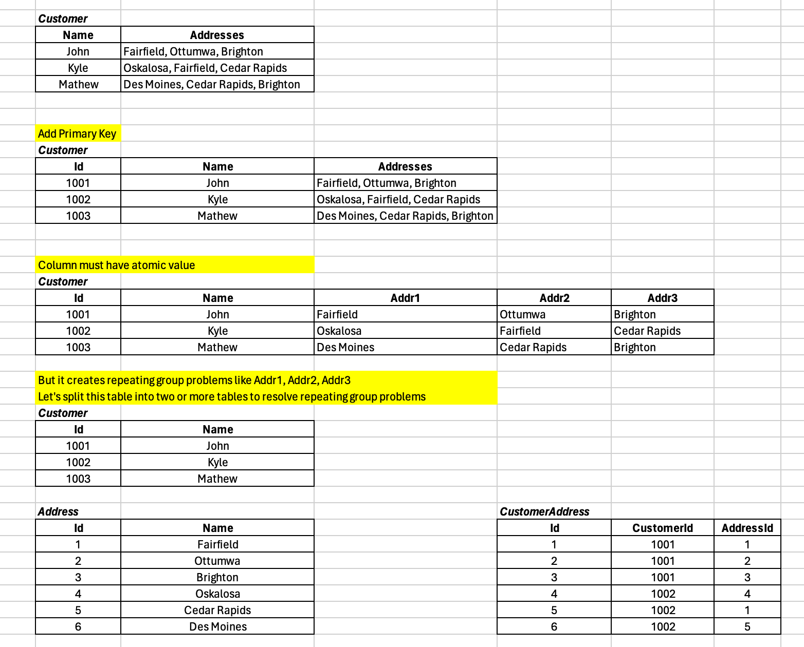
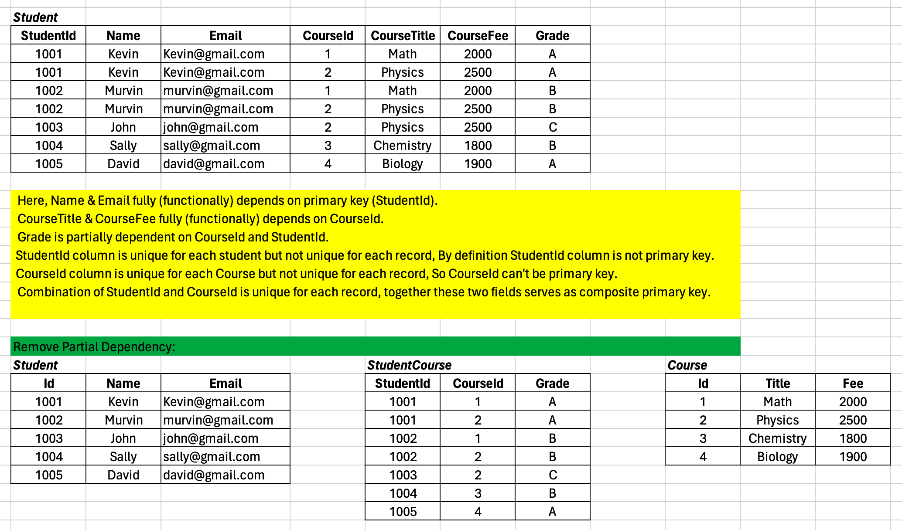
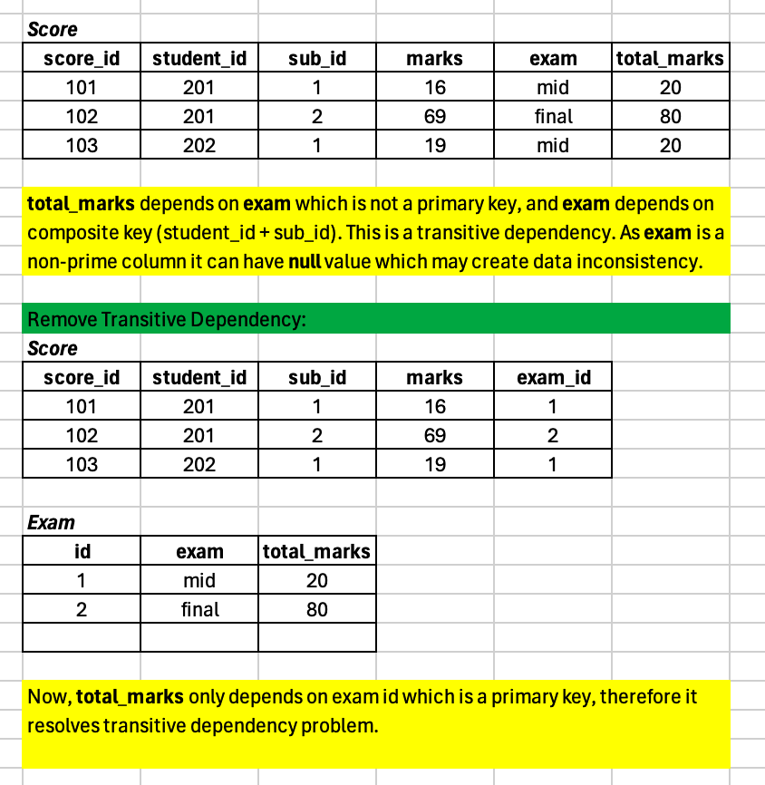

# Database
- [ ] [Normalization](#Normalization)
- [ ] [Key](#Key)
- [ ] [Trigger](#Trigger)
- [ ] [Transactions](#Transactions)
- [ ] [Indexing](#Indexing)
- [ ] [Joins](#)
- [ ] [Alias](#) 
- [ ] [Subquery](#)


## Normalization
- Database normalization is about organizing data in a database efficiently
- Database normalization is the process of restructuring an existing database schema to reduce redundancy and improve data integrity
- Normalization involves dividing a larger table into two or more tables and establishing relationships between these tables
- The objective is to isolate data in such a way that additions, deletions, and modifications can be made in one table and then propagated through the rest of the database via the defined relationships.
- Minimizes duplicate data, Prevents data inconsistencies, Simplifies queries, Enables flexible interface design, Improves scalability

### Denormalization
- Denormalization technique Focuses on improving the search performance.
- Merges two tables in order to reduce the number of joins to speed up query performance.

### First Normal Form (1NF)
- Every table must have primary key
- Every column must have atomic value
- Table must not have repeating groups



### Second Normal Form (2NF)
- The data must be in First Normal Form (1NF)
- Remove partial dependency from the table
- All the non-key columns must be fully dependent on primary key, it should not be partially dependent

**Dependency ~ Functional Dependency:** All columns are dependent on only `one` primary key. 

**Partial Dependency:** Partial Dependency happens when there's two or more primary key exists in one table (Candidate Key) 




### Third Normal Form (3NF)
- The data must be in First Normal Form (1NF) and Second Normal Form (2NF)
- Remove Transient/Transitive dependency from the table

**Transitive Dependency:** Happens when one column depends on another column which is not primary key.
Transitive dependency occurs when a non-key attribute depends on another non-key attribute. 

3NF ensures that each non-key attribute is directly dependent on the primary key.




### Refs:
- https://www.youtube.com/watch?v=9hfjC-BpY20
- https://www.youtube.com/watch?v=9L10Q1nAfyg
- https://blog.det.life/understanding-database-normalization-from-basics-to-er-diagrams-488a53923cf4
- https://medium.com/@13032765d/database-normalization-the-key-to-efficient-data-storage-6c0f38d30765


## Key
### Primary Key
- A column or a set of columns in a table that uniquely identifies each row.
- Must contain unique values
- `Cannot contain NULL` values 
- There can be `only one primary key` in a table.
- Every table should have a primary key to ensure data integrity and facilitate efficient querying.
- Primary key selection creates clustered index
- **Example:** The library catalog might designate a unique ID assigned to each book as the primary key for efficient retrieval and record keeping (this ID wouldn't be null).

### Foreign Key
- Creates a link between two tables. It references the primary key of another table.
- Can exist in multiple tables.
- Can be null (depending on the relationship type), but they must also exist as a value in the referenced primary key column.
- **Example:** In an Orders table, a customer_id foreign key column could link each order to a specific customer in the Customers table (referencing the customer_id primary key there).

### Unique Key
- Unique key ensures that all values in a column (or a set of columns) are unique. 
- `Can contain NULL` values, but `only one NULL value` is allowed per column. 
- A table can have `multiple unique keys`.
- Unique key selection creates non-clustered index
- **Example:** The ISBN number uniquely identifies a book (but it can be blank for some entries).

### Candidate Key
- A candidate key is a column or a set of columns that can uniquely identify each row in a table, similar to a primary key.
- `Can contain NULL` values
- A table can have multiple candidate keys.
- Candidate key does not necessarily have to be designated as the primary key of the table.
- **Example:** A combination of author name and book title could uniquely identify a book (but there might be multiple books by the same author).

## Trigger
### What is a trigger? How to create trigger in MySQL?
A trigger in a database is a set of actions that are automatically performed (or triggered) 
when a specified event occurs on a table.

**Create trigger in MySQL:**

Here's a basic syntax for creating a trigger - 
```sql
CREATE TRIGGER trigger_name
{BEFORE | AFTER} {INSERT | UPDATE | DELETE} ON table_name
FOR EACH ROW
BEGIN
    -- SQL statements to be executed when the trigger condition is met
END;
```

Let's say we have a table called `employees`, and we want to create a `trigger` that automatically updates 
the `last_update` column whenever a row in the `employees` table is updated:

```sql
CREATE TRIGGER update_last_update
AFTER UPDATE ON employees
FOR EACH ROW
BEGIN
    UPDATE employees
    SET last_update = NOW()
    WHERE id = NEW.id;
END;
```

- Creating triggers requires proper privileges on the database and the table involved.
- Using triggers excessively can impact database performance, so they should be designed thoughtfully.
- **Use case:** enforce data integrity, auditing, logging, data transformation/cleaning/validation, enforcing security etc. 

## Transactions
### Explain transactions and how to implement it in MySQL?
Transactions in databases are a fundamental concept that ensures data integrity and consistency 
by grouping one or more database operations into a single logical unit of work.
A transaction must satisfy the ACID properties. 

Here's an example illustrating the use of transactions in MySQL:

```sql
START TRANSACTION;

UPDATE accounts SET balance = balance - 100 WHERE account_id = 123;
UPDATE accounts SET balance = balance + 100 WHERE account_id = 456;

COMMIT;
```

In this example, two UPDATE statements are executed within a transaction block to transfer 100 units from account 123 to account 456. 
If both UPDATE statements succeed, the changes are committed to the database. 
If any part of the transaction fails, such as due to a constraint violation or an error, 
the changes are rolled back, and the database remains in its original state.

### ACID
`Atomicity:` The entire transaction is treated as a single unit. Either all statements succeed or none do.

`Consistency:` The transaction moves the database from one valid state to another, maintaining data integrity.

`Isolation:` Transactions should execute independently of other transactions. Transactions are isolated from each other, 
ensuring changes made by one transaction don't affect unfinished transactions.

`Durability:` Once a transaction is committed, the changes are permanent and survive system failures.

## Indexing
- Indexing is a technique used to optimize database query performance
- Creates data structures that allow for fast retrieval of rows based on the values of specific columns. 
- An index is essentially a pointer to the location of rows in a table, organized in a way that makes it efficient to locate the desired rows when querying the database.

### How Indexing Works
1. **_Data Structure:_** When you create an index on a column or a set of columns, MySQL creates a data structure (typically a `B-tree` or a `Hash table`) that maps the indexed column values to the corresponding rows in the table.
2. **_Fast Lookup:_** When you query the database using a condition on the indexed column(s), MySQL can quickly locate the rows that match the condition by traversing the index data structure rather than scanning the entire table.
3. **_Improved Performance:_** Indexing can significantly improve query performance, especially for tables with large numbers of rows or complex query conditions.

### Implementing Indexing in MySQL
You can create an index on one or more columns using the `CREATE INDEX` statement 
or by including the `INDEX` or `UNIQUE` keyword in the `CREATE TABLE` statement.

```sql
-- Syntax for creating an index after table creation
CREATE INDEX index_name ON table_name (column_name);

-- Syntax for creating an index during table creation
CREATE TABLE table_name (
    column1 datatype,
    column2 datatype,
    INDEX index_name (column_name)
);
```

### Using Indexes in Queries
MySQL automatically uses indexes to optimize query execution when appropriate. 
You can also explicitly specify the use of an index using the `USE INDEX` or `FORCE INDEX` hints.

```sql
-- Example of using an index hint
SELECT * FROM table_name USE INDEX (index_name) WHERE column_name = value;
```

### Types of Indexes
1. **Single-Column Index:** Index created on a single column.
2. **Composite Index:** Index created on multiple columns.
3. **Unique Index:** Ensures that all values in the indexed column(s) are unique.
4. **Primary Key Index:** A special type of unique index that uniquely identifies each row in the table.
5. **Full-Text Index:** Used for full-text searches on text columns.

### Monitoring and Maintaining Indexes
- Regularly monitor query performance using tools like `EXPLAIN` to ensure that indexes are being utilized effectively.
- Avoid unnecessary indexes, as they can degrade write performance and increase storage requirements.
- Periodically analyze and optimize indexes based on query patterns and performance metrics.

### Example
Let's create an index on the `email` column of a table named `users`:
```sql
-- create table
CREATE TABLE users (
    id INT PRIMARY KEY,
    username VARCHAR(50),
    email VARCHAR(100)
);
-- create index
CREATE INDEX idx_email ON users (email);
```
In this example, we've created a single-column index named `idx_email` on the email column of the users table. 
This index will improve the performance of queries that filter or search based on the email addresses of users.