# Java Fundamentals
- [ ] [JVM Internals](#jvm-internals)
- [ ] [Memory Management](#memory-management)
- [ ] [Garbage Collector](#garbage-collector)
- [ ] [Collection API](#collection-api)
- [ ] [Threading](#threading-)
- [ ] [Exceptions](#exception)
- [ ] [Comparator vs Comparable](#comparator-vs-comparable)
- [ ] [String Builder vs String Buffer]()
- [ ] [Functional Interfaces](#functional-interfaces)
- [ ] [Stream API]()
- [ ] [Asynchronous Programming](#asynchronous-programming-future-completablefuture)
- [ ] [Reactive Programming](#reactive-programming)
- [ ] Optional
- [ ] Reflection
- [ ] Unit Testing
- [ ] Java Feature Changes (8/14/17)


## JVM Internals

### Execution process of a Java program

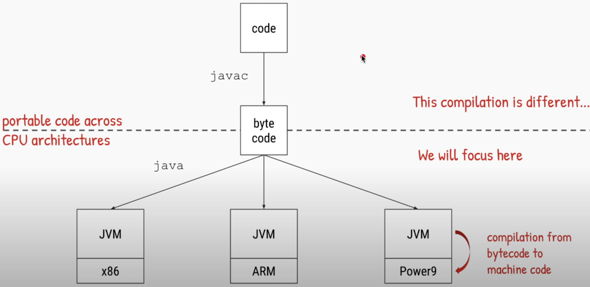

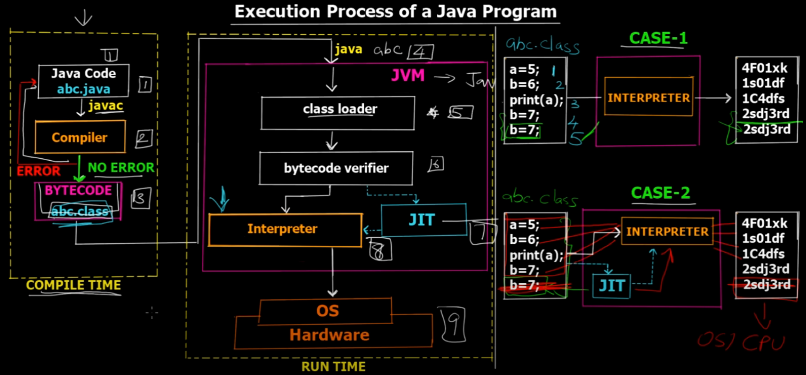

### JIT (Just In Time) Compilation
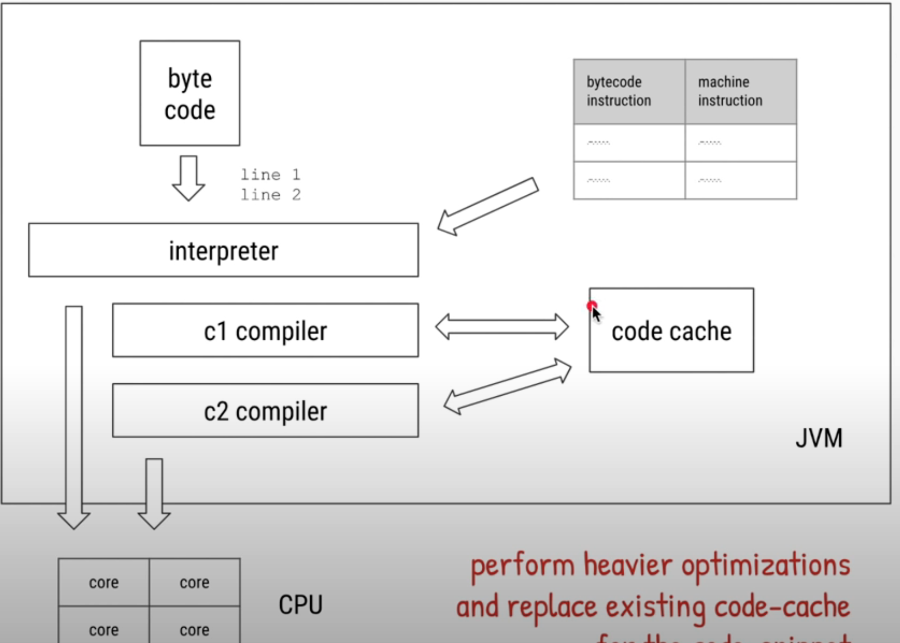

### AOT (Ahead of Time) Compilation
Ahead of Time (AOT) compiler is introduced in Java 9. Using AOT we can convert some of our java code/library into compiled code (machine instruction) even before we run the application. 

Compile classes beforehand while generating bytecode - 
```
jaotc --output libHelloWorld.so HelloWorld.class
```
Add this compiled code while starting the application - 
```
java -XX:AOTLibrary=./libHelloWorld.so HelloWorld
```

Unlike the bytecode, the compiled code is not portable and it's different for different architecture. So, the compiled code is not cross platform. As of Java 9, it only supports x86 architecture. 


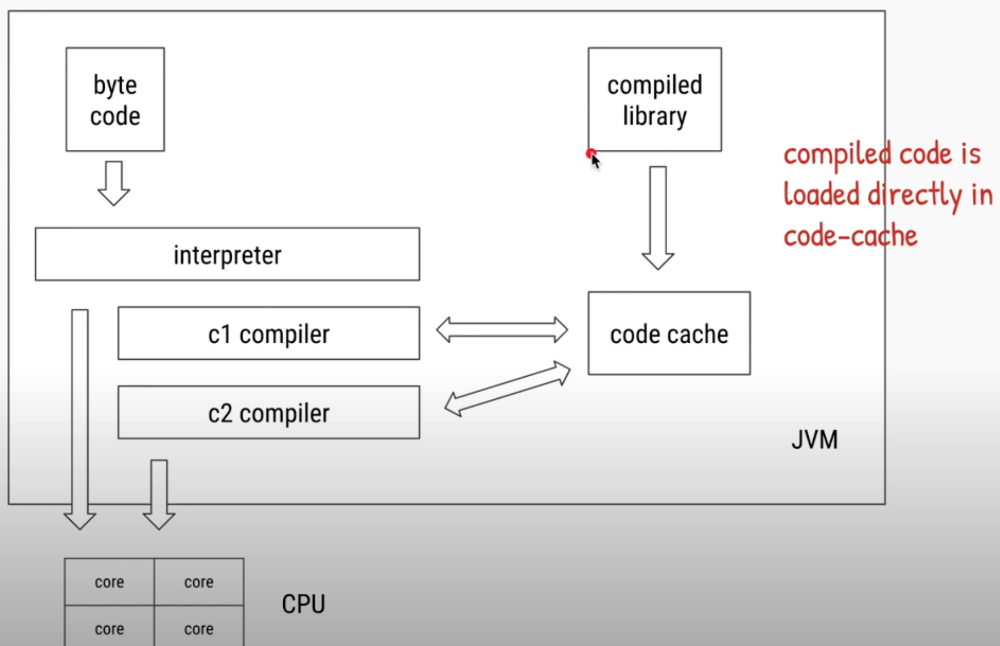


### Refs
- https://www.youtube.com/watch?v=GXUiEouK7DM&list=PLAQe3Pnt5c2Iez2AK2P05yuoiUiuvyDPT
- https://www.youtube.com/watch?v=sJVenujWGjs


## Memory management
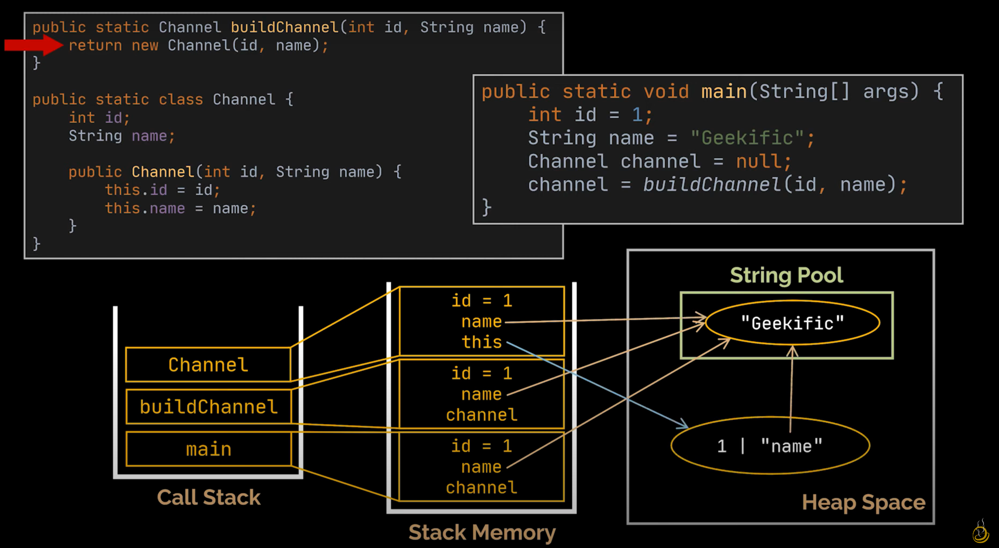

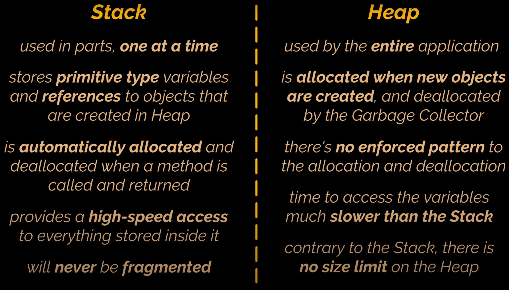

### Refs:
- https://www.youtube.com/watch?v=dH2LG3wxXbQ

## Garbage Collector
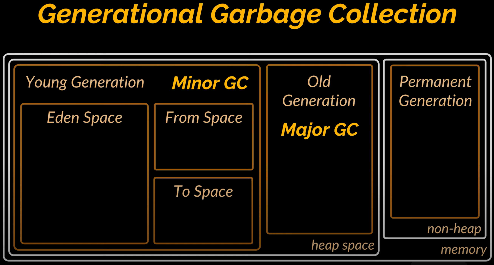

### Refs:
- https://www.youtube.com/watch?v=XXOaCV5xm9s


## Collection API

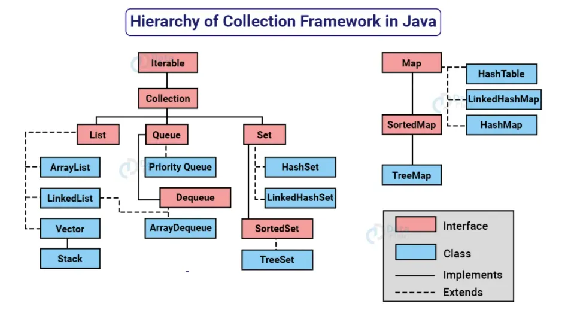

### Refs
- https://medium.com/edureka/java-collections-6d50b013aef8
- https://chazool.medium.com/java-collection-framework-1a26b56a310a


## Threading 
- Threading Basics
- Creating Threads 
- Race Condition and Synchronization
- Thread Lifecycle/States
- Types of Threads (User, Daemon)
- Thread pool executor
- Useful methods

### Refs
- https://tipsontech.medium.com/multi-threading-in-java-b33620ce7b0a
- Telusko videos: (85-90)
  - https://www.youtube.com/watch?v=KuvkahVyY9E
  - https://www.youtube.com/watch?v=UfMM924sBvg
  - https://www.youtube.com/watch?v=yyLy-an_CXY
  - https://www.youtube.com/watch?v=Z4KSgLpY0d8
  - https://www.youtube.com/watch?v=7eV4nib3Cm8
  - https://www.youtube.com/watch?v=IWll7sfz3g0
  - 

## Comparator vs Comparable

### Comparable
```java
public interface Comparable<T> {
    public int compareTo(T o);
}
```

```java
class Person implements Comparable<Person> {
    private String name;
    private Integer age;

    @Override
    public int compareTo(Person that) {
        return this.age - that.getAge();
    }
}
```

```java
private static void testComparable() {
    List<Person> personList = new ArrayList<>();
    personList.add(new Person("John", 32));
    personList.add(new Person("Natasha", 29));
    personList.add(new Person("DSarker", 31));

    Collections.sort(personList);
    System.out.println(personList);
}
```

Result
```
[Person{name='Natasha', age=29}, Person{name='DSarker', age=31}, Person{name='John', age=32}]
```

### Comparator
```java
@FunctionalInterface
public interface Comparator<T> {
    ...
    int compare(T o1, T o2);
    ...
}
```

```java
class PersonAgeComparator implements Comparator<Person> {
    @Override
    public int compare(Person p1, Person p2) {
        return p1.getAge() - p2.getAge();
    }
}

```

```java
private static void testComparator() {
    Comparator<Person> personNameLengthComparator = (p1, p2) -> {
        return p1.getName().length() - p2.getName().length();
    };

    List<Person> personList = new ArrayList<>();
    personList.add(new Person("John", 32));
    personList.add(new Person("Natasha", 29));
    personList.add(new Person("DSarker", 31));

    Collections.sort(personList, new PersonAgeComparator());
    System.out.println(personList);

    Collections.sort(personList, personNameLengthComparator);
    System.out.println(personList);

    Collections.sort(personList, (p1, p2) -> p1.getName().compareTo(p2.getName()));
    System.out.println(personList);
}
```

Result
```
[Person{name='Natasha', age=29}, Person{name='DSarker', age=31}, Person{name='John', age=32}]
[Person{name='John', age=32}, Person{name='Natasha', age=29}, Person{name='DSarker', age=31}]
[Person{name='DSarker', age=31}, Person{name='John', age=32}, Person{name='Natasha', age=29}]
```

### When to use Comparable and Comparator
The decision to use Comparable or Comparator depends on the requirements and design of your application. Here are some guidelines:

- Use Comparable when the sorting logic is inherent to the object being sorted and does not change.
- Use Comparable for natural ordering and Comparator for custom or alternative ordering.
- Use Comparator when you want to define multiple sorting rules.
- Use Comparator to provide the sorting logic if Class doesn't implement Comparable

### Refs
- https://medium.com/@himani.prasad016/comparable-vs-comparator-7aefb0a697c7
- https://www.youtube.com/watch?v=ZA2oNhtNk3w


## String Builder vs String Buffer

| Feature                 | StringBuilder                                          | StringBuffer                                           |
|-------------------------|--------------------------------------------------------|--------------------------------------------------------|
| **Introduced In**       | JDK 1.5                                                | JDK 1.0                                                |
| **Mutability**          | Mutable                                                | Mutable                                                |
| **Thread Safety**       | Not thread-safe (unsynchronized)                       | Thread-safe (synchronized)                             |
| **Performance**         | Faster (no synchronization overhead)                   | Slower (due to synchronization overhead)               |
| **Use Case**            | Single-threaded environments                           | Multi-threaded environments                            |
| **Synchronized Methods**| No                                                     | Yes                                                    |
| **Inheritance**         | Extends `AbstractStringBuilder`                        | Extends `AbstractStringBuilder`                        |
| **Common Methods**      | `append()`, `insert()`, `delete()`, `reverse()`, etc.  | `append()`, `insert()`, `delete()`, `reverse()`, etc.  |
| **Default Capacity**    | 16 characters                                          | 16 characters                                          |


## Exceptions
### Error 
Errors in a program are non-recoverable. Program gets terminated in case of error occurence.
Error can happen because of lack of system resources such as heap memory is not available etc. 
During the runtime of a program if any error occurs we will not be able to handle it.
Examples: `OutOfMemoryError`, `StackOverflowError`, 

### Exception
Exceptions are recoverable by handling them properly. 
Example: trying to access a property from a null object - `NullPointerException`,
dividing an interger by zero - `ArithmaticException` etc. 

### Exception Hierarchy
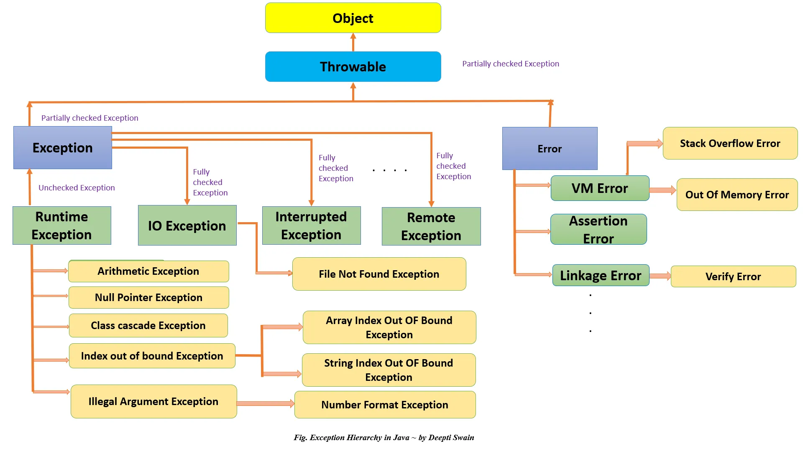

### Exception Types
- Checked
- Unchecked

#### Checked Exception
- All exceptions other than `RuntimeException` and `Error` are known as `Checked` exception
- These exceptions are checked by the compiler at compile time itself
- E.g. For file read operation compiler forces us to handle `FileNotFoundException` because it's possible that the file is not present
- Some other checked exceptions are `SQLException`, `IOException` etc. 

#### Unchecked Exception
- Runtime Exceptions are known as `Unchecked` exceptions. 
- Compiler doesn't force us to handle these exception but as a programmer it is our responsibility to handle runtime exceptions
- E.g. `NullPointerException`, `ArithmeticException`, `ArrayIndexOutOfBoundException` etc.


### Class Cascade Exception


### Finally vs Return
- Finally block gets executed even though return statement is available inside try block. 
- Finally block gets more priority than the return statement. 
- In case all try, catch, finally block return some value, then finally block return takes priority.

### Finally Vs System.exit(0)
- JVM gets exited when `System.exit(0)` code executes. 
- If we use `System.exit(0)` inside try block, then finally block will not execute. 
- Finally block will not execute if JVM crashes

### throw vs throws
**`throw`**
- used to explicitly throw an exception
- throw keyword is followed by an instance of an exception
- you can throw one exception at a time
- using throw keyword only unchecked exceptions are propagated

**`throws`**
- used with the method signature to declare an exception which might get thrown by the method while executing the code 
- throws is followed by exception class names
- you can declare multiple exceptions using throws keyword
- using throws keyword both checked and unchecked exceptions can be propagated
- used for ducking exception

### Refs
- https://interviewnoodle.com/exception-in-java-89a0b41e0c45

## Stream API

### Short Circuit Operation
- Intermediate: `Stream<T> limit(long N)`
- Terminal: 

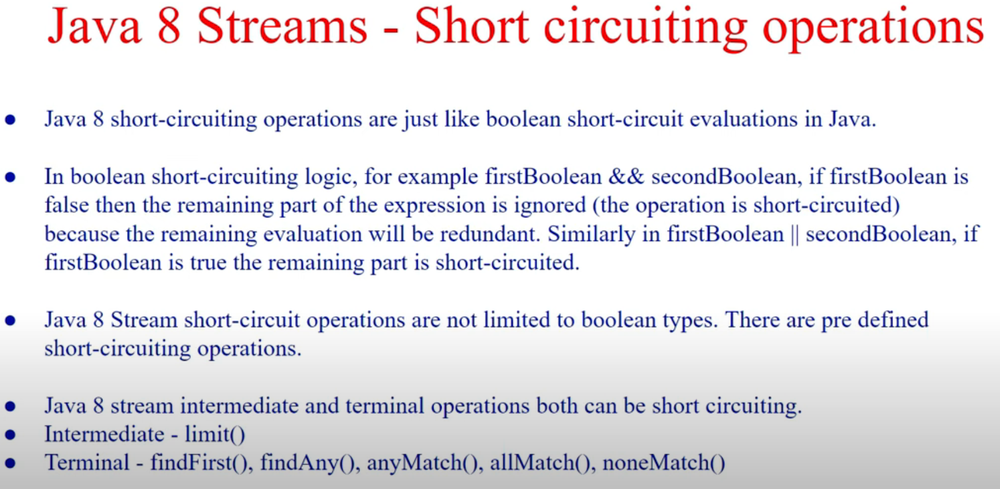


## Volatile:
In Java, the `volatile` keyword is used to indicate that a variable's value may be modified by multiple threads that are executing concurrently.
When a variable is declared as `volatile`, it ensures that any thread that reads the variable will see the most recently written value by any other thread.
Essentially, it provides visibility guarantees across threads.

Unlike `synchronized` blocks or methods, the volatile keyword does not provide `atomicity` guarantees.
It only ensures `visibility`. If multiple threads are writing to a volatile variable, it does not guarantee that the variable will be updated atomically.

Volatile is commonly used for flags or state variables that are accessed by multiple threads,
especially in scenarios where one thread modifies the value and other threads need to react to that change.

## Functional interfaces
| Interface Name	         | Signature	                 | Description                                                                                                               |
|-------------------------|----------------------------|---------------------------------------------------------------------------------------------------------------------------|
| Consumer<T>	            | `void accept(T t)`	        | Represents a function taking one argument (T) and performing an action without returning a value.                         |
| BiConsumer<T, U>	       | `void accept(T t, U u)`	   | Represents a function taking two arguments (T and U) and performing an action without returning a value.                  |
| Function<T, R>	         | `R apply(T t)`	              | Represents a function taking one argument (T) and returning a value of type (R).                                          |
| BiFunction<T, U, R>	    | `R apply(T t, U u)`	         | Represents a function taking two arguments (T and U) and returning a value of type (R).                                   |
| Predicate<T>	           | `boolean test(T t)`	         | Represents a function taking one argument (T) and returning a boolean based on a condition.                               |
| BiPredicate<T, U>       | `boolean test(T t, U u)`      | Represents a function that takes two arguments and returns a boolean value based on a condition involving both arguments. |
| Supplier<T>	            | `T get()`	                   | Represents a function that doesn't take arguments but supplies (returns) a value of type (T).                             |
| Runnable	               | `void run()`	                | Represents a piece of code to be executed without arguments and doesn't return a value.                                   |
| Callable<T>	            | `T call() throws Exception`	 | Represents a piece of code to be executed (potentially throwing exceptions) and returning a value of type (T).            | 
| Comparator<T>	          | `int compare(T o1, T o2)`	 | Comparator                                                                                                                | 


## Stream API

## Asynchronous Programming (Future, CompletableFuture)
- Using asynchronous programming you can write non-blocking code where concurrently you can run N number of tasks 
in separate thread without blocking main thread. 
- When the task is complete, it notifies the main thread
- `Future`, `CompletableFuture`, `ExecutorService`, `Callback Interfaces`, `Thread Pools` etc. can be used to implement asynchronous programming

### Drawbacks of Future
- It can't be completed manually
- Multiple Future can't be chained together
- Multiple Future can't be combined
- No proper exception handling mechanism

To resolve these issues `CompletableFuture` has been introduced. 

### CompletableFuture
CompletableFuture is a class in Java's `java.util.concurrent` package that represents a future result of an asynchronous computation. 
It is an implementation of the `Future` interface with additional capabilities to handle and compose asynchronous tasks.

- **Asynchronous Computations:** `CompletableFuture` allows you to run tasks asynchronously without blocking the main thread.

- **Creation:** Can be created using `CompletableFuture.runAsync(Runnable)` and `CompletableFuture.supplyAsync(Supplier)` method

- **Non-blocking:** Unlike `Future`, which requires explicit blocking to retrieve the result, 
`CompletableFuture` provides methods that allow you to specify actions to be taken upon completion of the computation, thus avoiding blocking.

- **Composability:** It provides a rich set of methods to compose multiple futures, such as `thenApply`, `thenCombine`, `thenCompose`, etc., enabling the creation of complex asynchronous pipelines.

- **Completion:** You can manually complete a `CompletableFuture` using methods like `complete`, `completeExceptionally` or `obtrudeValue`.

- **Exception Handling:** It offers methods to handle exceptions that may occur during the asynchronous computation, such as `exceptionally`, `handle`, and `whenComplete`.

#### runAsync
Runs background task asynchronously and doesn't return anything from that task. Takes `Runnable` Object and returns `CompletableFuture<Void>`
```java
CompletableFuture<Void> runAsync(Runnable runnable);
CompletableFuture<Void> runAsync(Runnable runnable, Executor executor);
```

#### supplyAsync
Runs background task asynchronously and returns data from that task. Takes `Supplier<T>` Object and returns `CompletableFuture<T>`
```java
CompletableFuture<T> supplyAsync(Supplier<T> supplier);
CompletableFuture<T> supplyAsync(Supplier<T> supplier, Executor executor);
```

If we don't provide `Executor` then, it will get the thread from `ForkJoin` global pool. 

#### thenApply & thenApplyAsync
Transforms the result of the `CompletableFuture` **(synchronously/asynchronously)** using the provided function 
and returns a new `CompletableFuture` with the transformed result.

Signature:
```java
CompletableFuture<T> thenApply(Function fn);
CompletableFuture<T> thenApplyAsync(Function fn);
CompletableFuture<T> thenApplyAsync(Function fn, Executor executor);
```

Usage:
```java
CompletableFuture<Integer> future = CompletableFuture.supplyAsync(() -> 5);
CompletableFuture<Integer> resultFuture = future.thenApply(n -> n * 2);
resultFuture.thenAccept(System.out::println); // Output: 10
```

#### thenAccept & thenAcceptAsync
Consumes the result of the `CompletableFuture` **(synchronously/asynchronously)** using the provided consumer, 
performing an action with the result but not returning a new result.

Signature:
```java
CompletableFuture<Void> thenAccept(Consumer action);
CompletableFuture<Void> thenAcceptAsync(Consumer action);
CompletableFuture<Void> thenAcceptAsync(Consumer action, Executor executor);
```

Usage:
```java
CompletableFuture<Integer> future = CompletableFuture.supplyAsync(() -> 5);
future.thenAccept(n -> System.out.println("Result: " + n)); // Output: Result: 5

```

#### thenRun & thenRunAsync
Runs a specified Runnable action **(synchronously/asynchronously)** when the CompletableFuture completes, 
without using its result.

Signature:
```java
CompletableFuture<Void> thenRun(Runnable action);
CompletableFuture<Void> thenRunAsync(Runnable action);
CompletableFuture<Void> thenRunAsync(Runnable action, Executor executor);
```

Usage:
```java
CompletableFuture<Integer> future = CompletableFuture.supplyAsync(() -> 5);
future.thenRun(() -> System.out.println("Task completed.")); // Output: Task completed.
```

### Refs:
- https://www.youtube.com/watch?v=GJ5Tx43q6KM
- https://www.youtube.com/watch?v=oFRtBuRviHM


### Spring Boot | Asynchronous | @Async Annotation
- https://www.youtube.com/watch?v=R_gejlOXR7g
- https://www.youtube.com/watch?v=3rJBLFA95Io


## Reactive Programming
- Asynchronous & Non-blocking
- Functional style code
- Data flow as event driven stream (pub-sub)
- Backpressure on data streams

### Thread Processing:

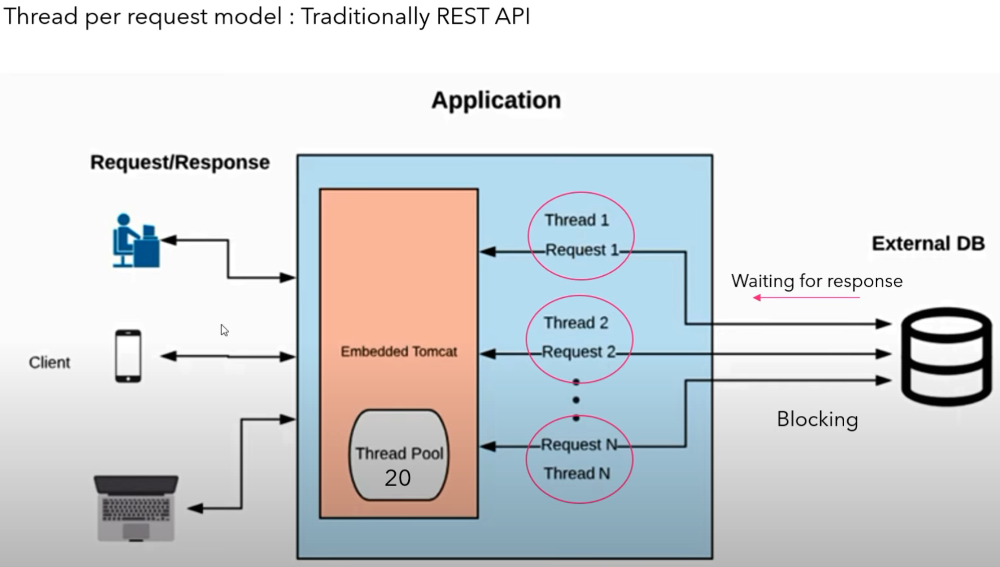

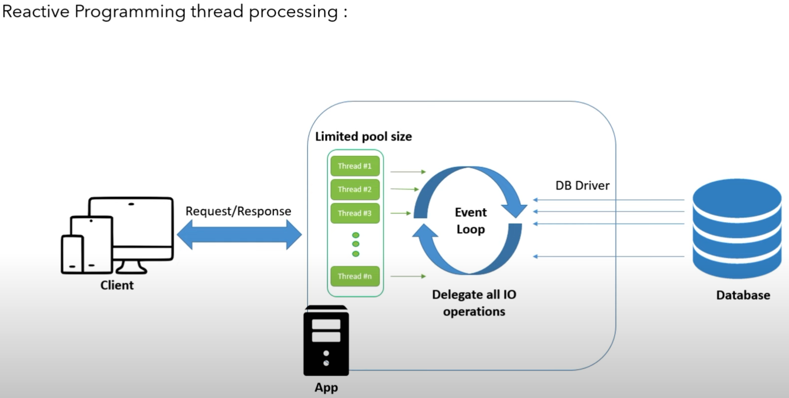


### Reactive Stream Specification
- Publisher
- Subscriber
- Subscription
- Processor

##### Publisher<T> Interface
A Publisher is a provider of a potentially unbounded number of sequenced elements, 
publishing them according to the demand received from its `Subscriber(s)`.

```java
void subscribe(Subscriber<? super T> s);
```

##### Subscriber<T> Interface
A `Subscriber` receives and processes elements from a `Publisher`.
```java
void onSubscribe(Subscription s);
void onNext(T t);
void onError(Throwable t);
void onComplete();
```

##### Subscription Interface
A `Subscription` represents a one-to-one lifecycle of a `Subscriber` subscribing to a `Publisher`. 
It can be used to control the flow of data, allowing the `Subscriber` to request elements and to cancel the subscription.
```java
void request(long n);
void cancel();
```

##### Processor<T, R> Interface
A Processor is a component that acts as both a `Subscriber` and a `Publisher`. It represents a processing stage that transforms data elements passing through it.
This interface extends both `Subscriber<T>` and `Publisher<R>`.


### Reactive Stream Workflow
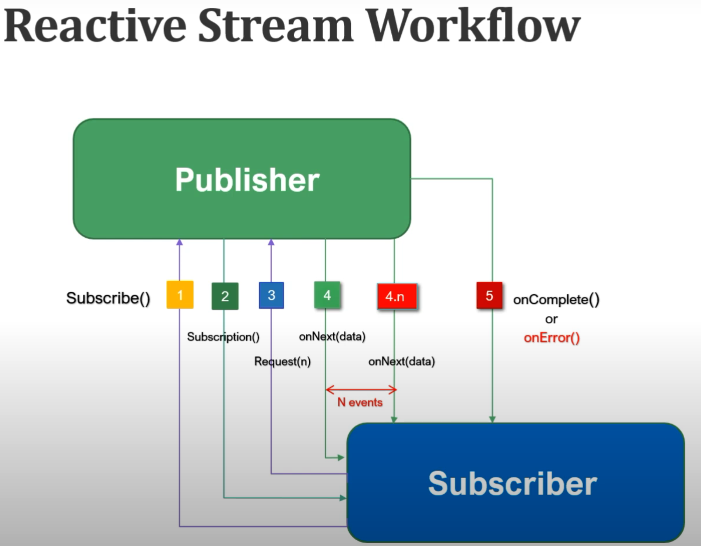


### Data Types - Flux, Mono
### Project Reactor
### RxJava
### Spring Webflux

### Refs
- https://www.youtube.com/playlist?list=PLVz2XdJiJQxyB4Sy29sAnU3Eqz0pvGCkD
