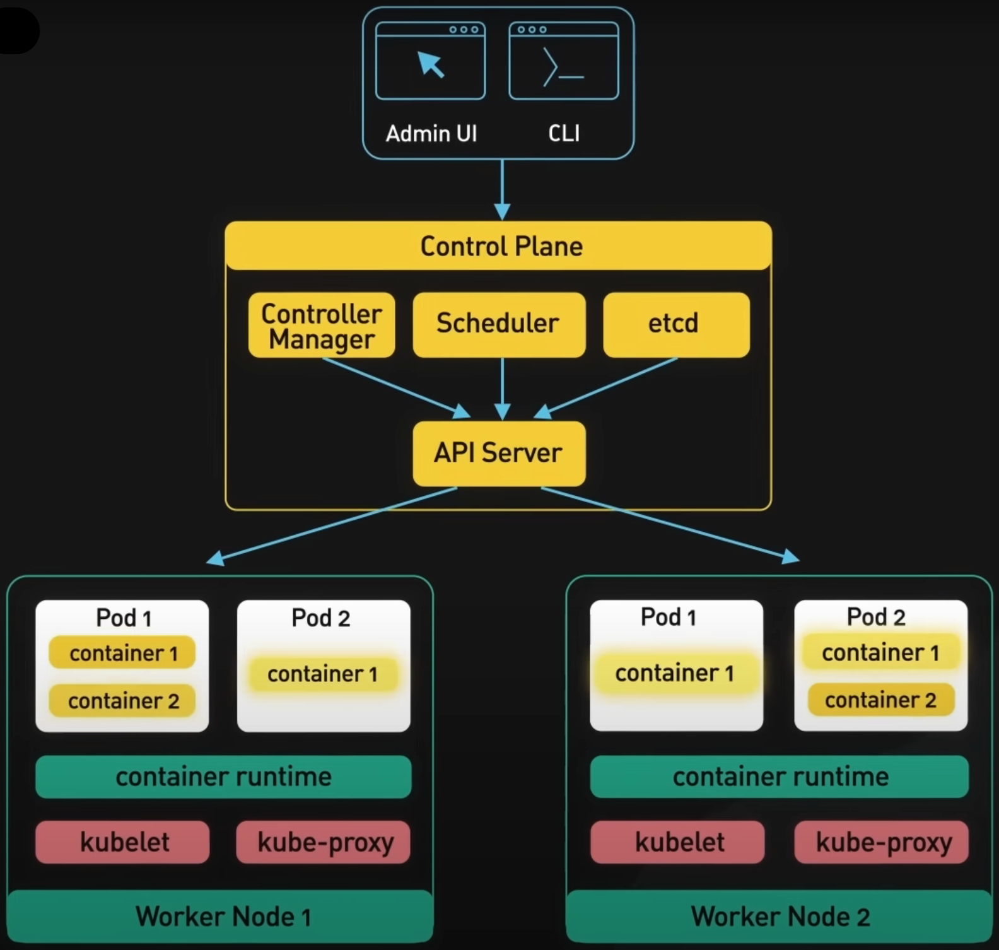

# Kubernetes

## Introduction

### Refs:
- https://blog.bytebytego.com/p/a-crash-course-in-kubernetes
- https://www.youtube.com/watch?v=TlHvYWVUZyc

## Spring Cloud Kubernetes
### Refs:
- https://www.springcloud.io/post/2022-05/spring-cloud-kubernetes/#gsc.tab=0
- https://spring.academy/guides/kubernetes-app-enhancements-spring-k8s
- https://hub.alfresco.com/t5/alfresco-process-services/spring-cloud-kubernetes-example/ba-p/288781
- https://github.com/piomin/sample-spring-microservices-kubernetes
  - https://piotrminkowski.com/2018/08/02/quick-guide-to-microservices-with-kubernetes-spring-boot-2-0-and-docker/
- https://www.baeldung.com/spring-cloud-kubernetes
  - https://github.com/eugenp/tutorials/tree/master/spring-cloud-modules/spring-cloud-kubernetes
- 