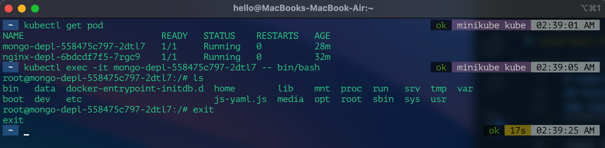
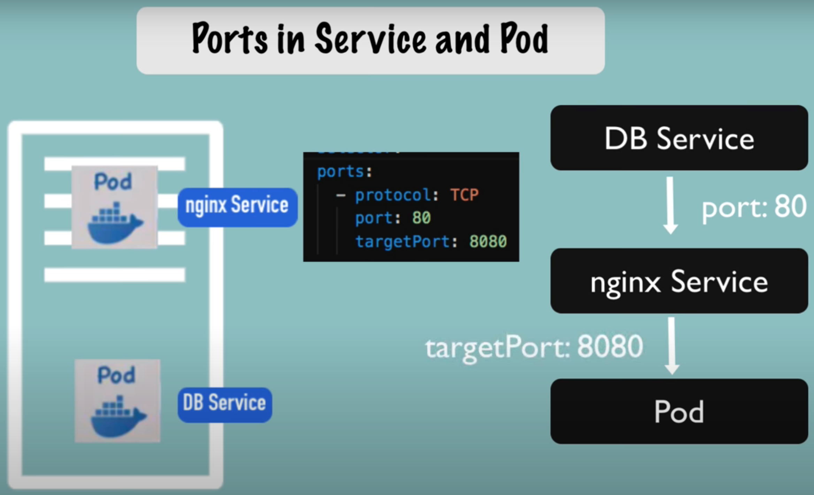
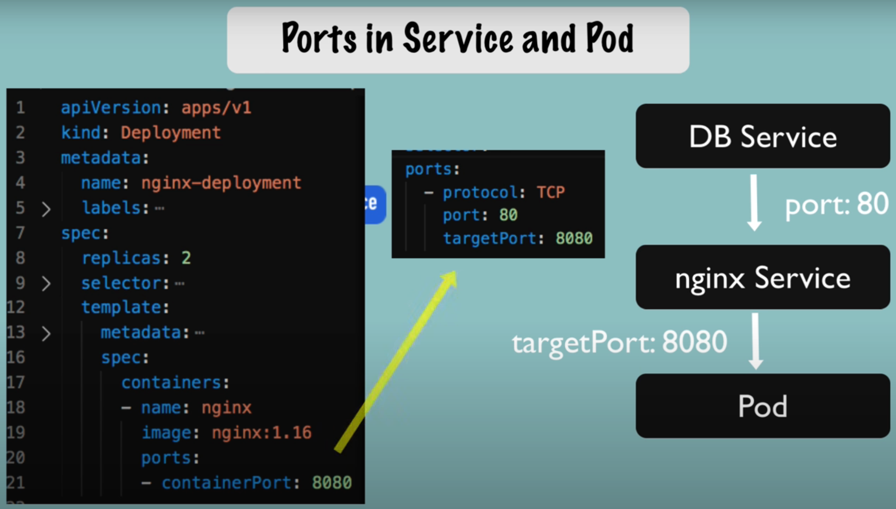
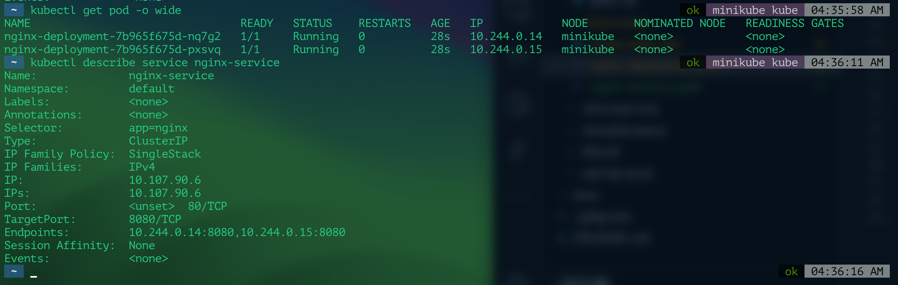

# Kubernetes

## Introduction


### Refs:
- https://blog.bytebytego.com/p/a-crash-course-in-kubernetes
- https://www.youtube.com/watch?v=TlHvYWVUZyc
- https://www.youtube.com/playlist?list=PLVz2XdJiJQxybsyOxK7WFtteH42ayn5i9
- https://www.youtube.com/playlist?list=PLTyWtrsGknYdHLSdZz9fW0cMnpZny3UPL

## Spring Cloud Kubernetes


### Working Demo Refs
- https://www.youtube.com/watch?v=UDg7y9TheI4
- https://github.com/ryanjbaxter/spring-cloud-k8s-demo/tree/s1-2021
- https://github.com/ryanjbaxter/spring-cloud-kubernetes/tree/s1-2021


### ConfigMap and Discovery Client
- https://www.youtube.com/playlist?list=PLTyWtrsGknYcwS1mQAIwm_D8QgOugD_Pt
- 

### Service Mesh and Istio
- https://www.youtube.com/playlist?list=PLTyWtrsGknYfjeCPsuae_Quc20SJO4nex
-

### Refs:
- https://www.springcloud.io/post/2022-05/spring-cloud-kubernetes/#gsc.tab=0
- https://spring.academy/guides/kubernetes-app-enhancements-spring-k8s
- https://hub.alfresco.com/t5/alfresco-process-services/spring-cloud-kubernetes-example/ba-p/288781
- https://github.com/piomin/sample-spring-microservices-kubernetes
  - https://piotrminkowski.com/2018/08/02/quick-guide-to-microservices-with-kubernetes-spring-boot-2-0-and-docker/
- https://www.baeldung.com/spring-cloud-kubernetes
  - https://github.com/eugenp/tutorials/tree/master/spring-cloud-modules/spring-cloud-kubernetes


## Minikube & Kubectl
### Install Minikube on MacOs (M1)
update brew 
```
brew update
```
install minikube
```
brew install minikube
```
start cluster
```
minikube start
```

Note: 
- kubectl will be installed automatically
- Start docker before starting kubernetes cluster
  
### minikube commands
minikube start/pause/stop/delete/status commands
```
minikube start
minikube stop
minikube pause
minikube delete
minikube status
```

### kubectl commands
check version - 
```
kubectl version
```

get nodes/deployment/pod/services/replicaset - 
```
kubectl get nodes
kubectl get deployment
kubectl get pod
kubectl get services
kubectl get replicaset
```
```
kubectl get pod -o wide
```
get deployment file in yaml format and write to a file (includes status) - 
```
kubectl get deployment nginx-deployment -o yaml > nginx-depl-status.yaml
```


create deployment - 
```
kubectl create deployment NAME --image=image [--dry-run] [options]
```
```
kubectl create deployment nginx-depl --image=nginx ## Example: creating deployment for nginx image
```

Edit deployment (after applying the edits the old pod will terminate and new pod will be started)
```
kubectl edit deployment [DEPLOYMENT NAME]
```


Delete deployment
```
kubectl delete deployment [DEPLOYMENT NAME]
```

Debugging pods: check logs - 
```
kubectl logs [POD NAME]
```

Debugging pods: get additional information about pod - 
```
kubectl describe pod [POD NAME]
```

Debugging pods: Open terminal of a application container for debugging purpose - 
```
kubectl exec -it [POD NAME] -- bin/bash
```


Apply deployment configuration file - 
```
kubectl apply -f [DEPLOYMENT-CONFIG-YAML-FILE]
```

Delete deployment configuration - 
```
kubectl delete -f [DEPLOYMENT-CONFIG-YAML-FILE]
```

#### Refs:
- https://www.youtube.com/watch?v=azuwXALfyRg&list=PLy7NrYWoggjziYQIDorlXjTvvwweTYoNC&index=6
- https://gitlab.com/nanuchi/youtube-tutorial-series/-/blob/master/basic-kubectl-commands/cli-commands.md


## Configuration Files
Each configurtion file has 3 parts:
- metadata
- specification
- status (automatically generated and added by kubernetes)

Status: 
- Automatically generated and added by kubernetes
- If kubernetes finds any difference between desired state and actual state, it's gonna try to fix it
-  This is the basis of self healing feature of kubernetes
-  Current status data is stored in `etcd`


Sample Deployment Config file: `nginx-deployment.yaml`
```yaml
apiVersion: apps/v1
kind: Deployment

metadata:
  name: nginx-deployment
  labels:
    app: nginx

spec:
  replicas: 2
  selector:
    matchLabels:
      app: nginx
  template:
    metadata:
      labels:
        app: nginx
    spec:
      containers:
      - name: nginx
        image: nginx:1.16
        ports:
        - containerPort: 8080
```

Sample Service Config file:
```yaml
apiVersion: v1
kind: Service

metadata:
  name: nginx-service

spec:
  selector:
    app: nginx
  ports:
    - protocol: TCP
      port: 80
      targetPort: 8080 

```

Note: 
- Service `spec->selector->app` should match with deployment `metadata->labels->app` and pod `spec->template->metadata->labels->app`
- Service `targetPort` should match with Pod `containerPort`
- 

### Ports in Service and Pod




### Demo
Apply the deployment and service files mentioned above and describe service. 



### Refs:
- https://www.youtube.com/watch?v=qmDzcu5uY1I&list=PLy7NrYWoggjziYQIDorlXjTvvwweTYoNC&index=7
- https://gitlab.com/nanuchi/youtube-tutorial-series/-/blob/master/basic-kubectl-commands/demo-test-deployment.yaml